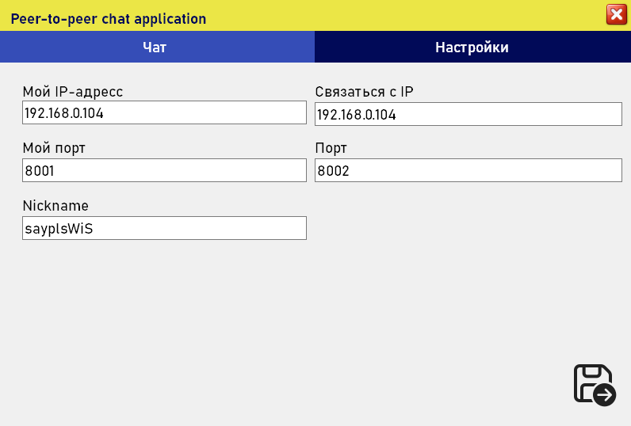
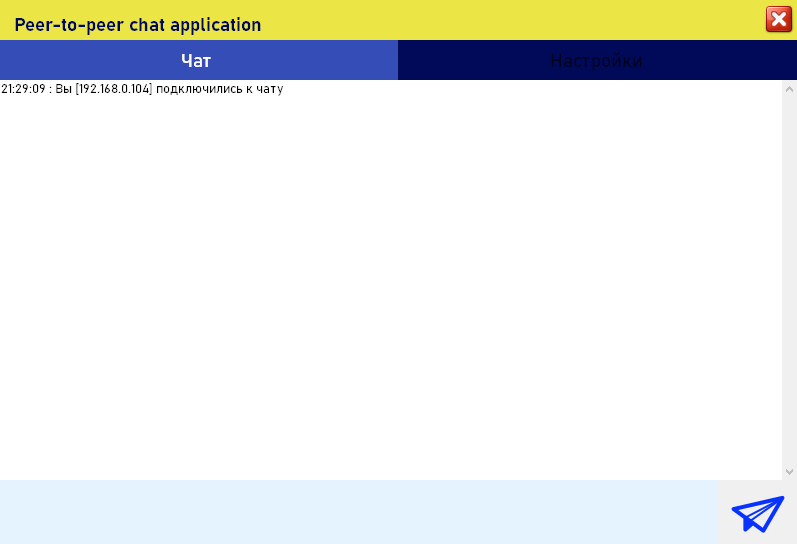
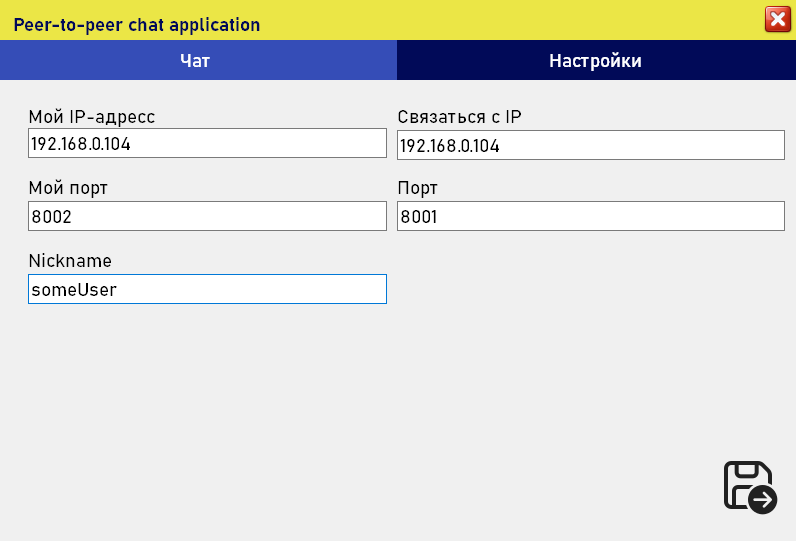
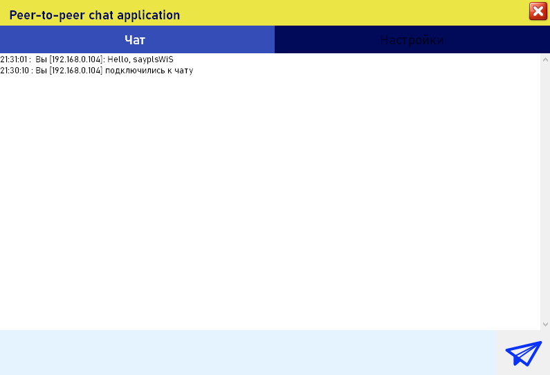
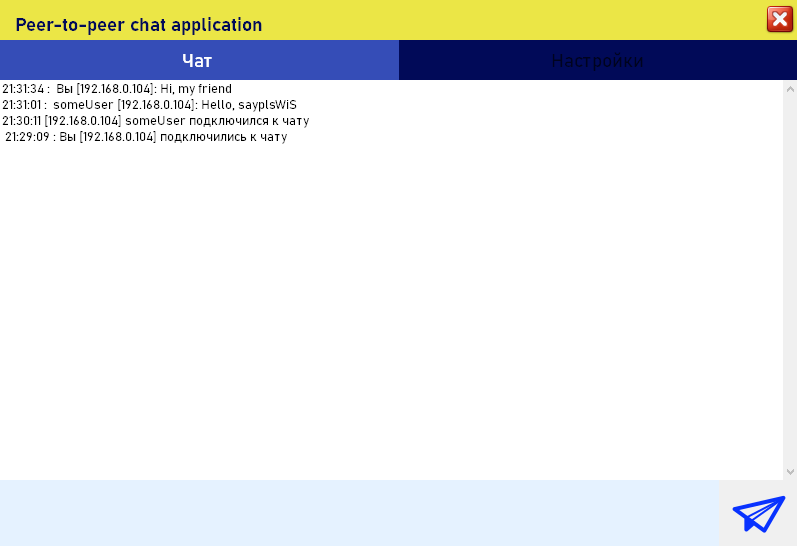

# ChatP2P
<h1>How to use</h1>
 <h3>Set up preferences for the first clone of the application</h3>
  

<h3>Apply!</h3>

 <h3>Set up preferences for the second clone of the application</h3>
 

<h3>Apply!</h3>

<h3>Communicate!</h3>

